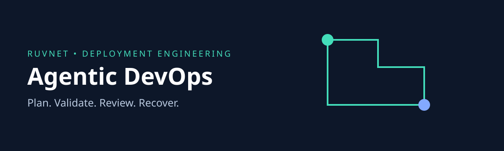

# Agentic DevOps v2 alpha

Turn a small deployment specification into consistent Docker, Kubernetes and CI files. Review exactly what changes before handing the files to your deployment system. Restore a previous artifact bundle when a change must be reversed.

This release replaces the historical model driven shell execution interface with a deterministic local planner. It never runs deployment commands, reads cloud credentials or calls a model. Existing Python users must follow the [migration guide](docs/migration.md).

## Capabilities

| Capability | Behavior |
| --- | --- |
| Artifact generation | Dockerfile, Deployment, Service, NetworkPolicy and GitHub CI template |
| Policy validation | Rejects mutable image tags, unknown fields, privileged ports, excessive resources and any edited bundle |
| Preview | Reports changed files while keeping resource name and namespace fixed |
| Rollback planning | Returns the exact prior validated bundle only when the current digest matches |
| CLI and MCP | Seven actions share the same implementation and policy |
| MetaHarness | Repository maintainer profiles, sessions, field memory adapter and host integration |
| Autogenous | Evidence gates without automatic production promotion |
| CI delivery | Tests, dependency audit and downloadable artifact/benchmark evidence |

## Install and use

Requires Node 22 or 24. No API key is required.

```sh
npm ci
npm test
node src/cli.mjs status
node src/cli.mjs plan < examples/spec.json > plan.json
node src/cli.mjs validate < plan.json
npm run benchmark
```

The example digests are deliberately fictional fixtures. Replace `image` with an existing, reviewed application image digest and `baseImage` with a verified compatible base digest. The Dockerfile expects an executable `app/server`; it does not compile your application. Registry availability, image signatures, vulnerability scanning and an actual cluster rollout are deployment qualification steps, not claims made by this planner.

Commands `plan`, `validate`, `preview` and `rollback` accept JSON on stdin, bounded to 64 KiB. Output is JSON. Extract the fixed `artifacts` map to a review directory using your trusted deployment tooling. See [operations](docs/operations.md) for request examples and runtime assumptions.

## Connect an agent

```json
{"mcpServers":{"agentic-devops":{"command":"node","args":["/absolute/path/agentic-devops/src/mcp.mjs"]}}}
```

Tools: `devops_status`, `devops_plan`, `devops_validate`, `devops_preview`, `devops_rollback`, `devops_test`, `devops_benchmark`. Each takes `{ "input": { ... } }`. Policy resource: `ruv://agentic-devops/policy`.

Tests launched through the CLI or MCP require the local operator to set `AGENTIC_DEVOPS_ALLOW_TESTS=1`. The subprocess has a 30 second deadline, 64 KiB output limit, one concurrent execution and a stripped environment. MCP callers cannot choose commands, filesystem paths or environment variables. Stdio runs with the launching user's identity and is intended for trusted local hosts.

## Security and evidence

Kubernetes output uses a nonroot UID, dropped capabilities, read only root filesystem, no service account token, resource limits and deny all egress. Same namespace pods may reach the service. NetworkPolicy requires a supporting CNI. A local digest proves byte consistency, not authorship or deployment authorization.

Read the [security review](docs/security.md), [architecture decision](docs/adr/001-reviewed-artifacts.md), [benchmark methodology](docs/benchmark.md) and [migration guide](docs/migration.md). Historical UI screenshots and source are retained for provenance, not offered as a supported deployment path.

## RuV ecosystem

Use [RuFlo](https://github.com/ruvnet/ruflo) for orchestration, [MetaHarness](https://github.com/ruvnet/metaharness) for repeatable evaluations, [Autogenous](https://github.com/ruvnet/autogenous) for evidence gates, [Guardrail](https://github.com/ruvnet/guardrail) for application policies, [Dynamo MCP](https://github.com/ruvnet/dynamo-mcp) for project scaffolding and [Federated MCP](https://github.com/ruvnet/federated-mcp) for public federation reads. [x.ruv.io](https://x.ruv.io) messages are data, never deployment permission.

MIT license. Legacy vendored components retain their own license notices.

## Repository harness

See the [generated MetaHarness guide](.harness/generated/README.md) and [Autogenous gate guide](.harness/autogenous/README.md). Generated sessions and field memory require deployment owned identity and storage configuration; their presence does not mean a remote memory service is deployed.
